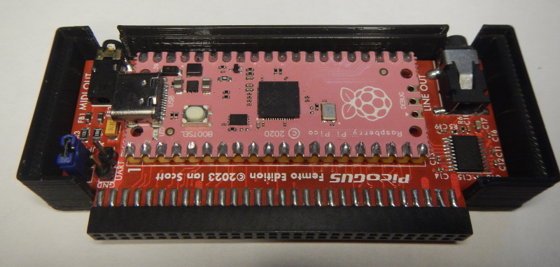
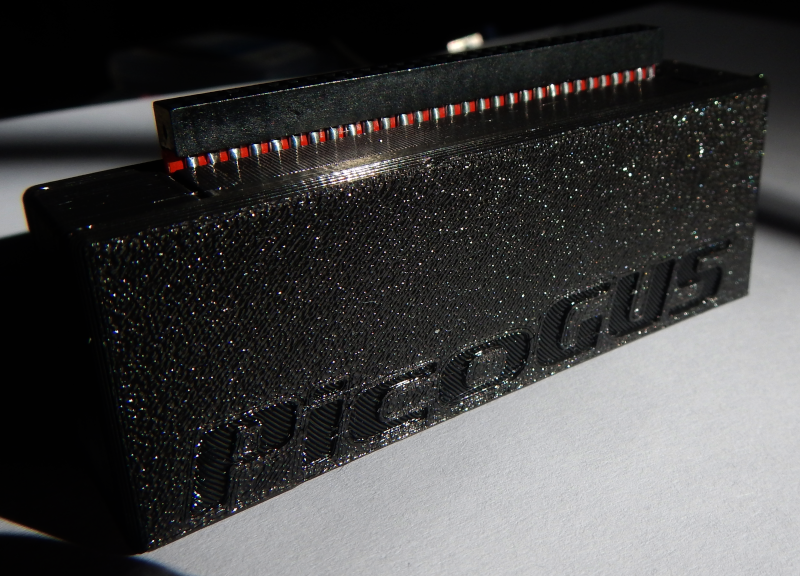
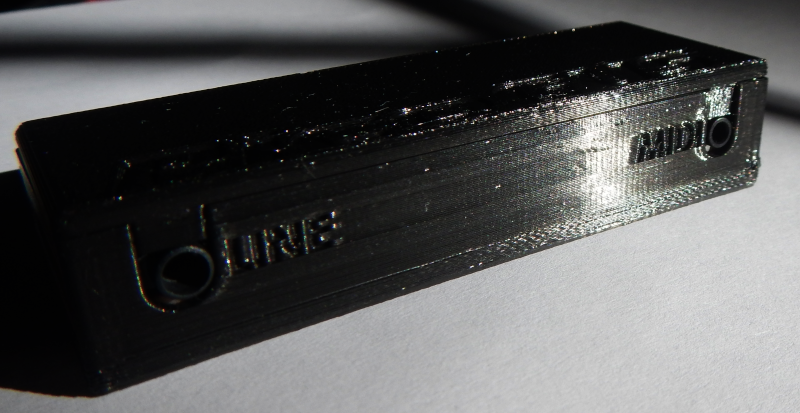

# PicoGUS-Femto-LowProfile_Case
Low-profile case for the **PicoGUS Femto edition**

This is a low-profile case for the **[PicoGUS Femto Edition](https://github.com/polpo/picogus)**.

For soldering the **Raspberry Pi Pico** *directly* onto the board **without using a connector**.

Files:
- ***[PicoGUS-Femto-Top.FCStd](PicoGUS-Femto-Top.FCStd)*** - FreeCAD model of top cover
- ***[PicoGUS-Femto-Bottom.FCStd](PicoGUS-Femto-Bottom.FCStd)*** - FreeCAD model of case bottom
- ***[PicoGUS-Femto-Top.stl](PicoGUS-Femto-Top.stl)*** - 3D-model of top cover
- ***[PicoGUS-Femto-Bottom.stl](PicoGUS-Femto-Bottom.stl)*** - 3D-model of case bottom

*© prcoder, 2025*
